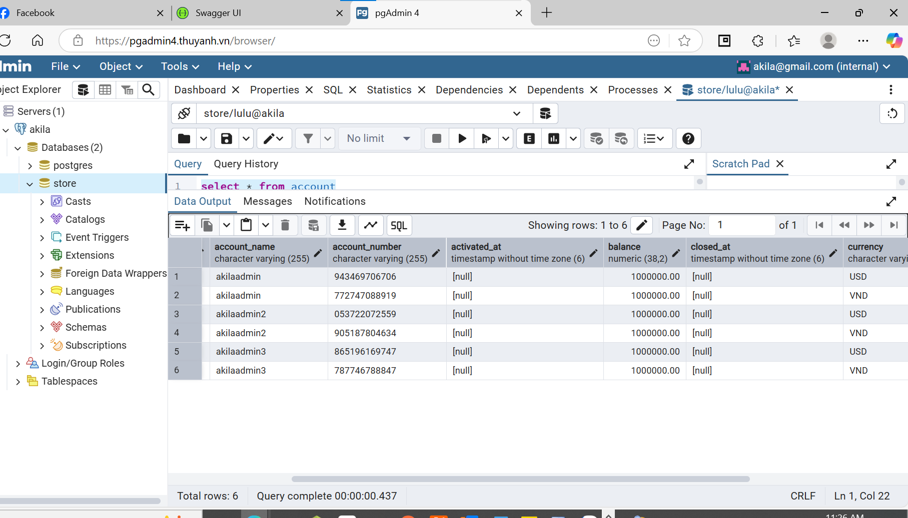

###  Akila Assignment
### Please Readme
I know that the requirements should ignore authentication and security aspects. But because we build transaction money application,
I think we should have some basic security features. 
I write some custom bearer token authentication so we can ensure they tranfer money from thier account, not from other people account.
Dont worry, I init the data demo for you. You can easy to login and test the application.
I also write some unit test for you. You can run it by mvn test.

Akila Assignment. We using Sping boot 3.1.4. Using Open API. We have implemented the following features:
1. User can register and login.
2. User can transfer money to another user.
3. User can view the transaction history.

## DEMO
DEMO/SWAAGGER: https://akila.thuyanh.vn/swagger-ui/index.html 
   default username: akilaadmin
   password: akila@123456 

PGADMIN: https://pgadmin4.thuyanh.vn/
   default username: akila@gmail.com
   password: akila@123456

DEFAULT ACCOUNT NUMBER FOR TRANSFER TESTING:

Running on AWS EC2:
- IP/PUBLIC DNS: ec2-3-24-110-17.ap-southeast-2.compute.amazonaws.com
- user: ubuntu
- pem: aws.pem

## Requirements running local
- Java 17
- Maven
- Docker
- Docker Compose

## How to run in localhost
1. Clone the repository
2. cd into the project directory
3. Run `mvn clean install`
3. Run `docker-compose up --build`
4. The application will be available at `http://localhost:8080`
5. The database will be available at `http://localhost:5432`
6. The Redis will be available at `http://localhost:6379`
7. The PGAdmin will be available at `http://localhost:5050`
8. Auto init admin: username: akilaadmin/akilaadmin2/akilaadmin3, password: akila@123456

## API Documentation
- Swagger UI CORE ADMIN: `http://localhost:8080/swagger-ui/index.html
- API documentation is available at `http://localhost:8080/v3/api-docs.yaml`
3. Coding, Naming, Security, Technology Standards
   Coding Standards
    - Followed the Java coding standards. Microservices are built using Java 17.
    - Clean architecture.
    - Using Entity class with @Entity annotation. Autorename entity [StorePhysicalNamingStrategy.java]
    - Using Liquibase for database migration but only example two tables.
    - Using Repository classes with @Repository annotation.
    - Using Service classes with @Service annotation.
    - Using Controller classes with @RestController annotation.
    - Using Google Captcha for security. But application.properties set to false to test.
    - CORS is enabled for all the endpoints.
    - Using Adapter, Domain, Interface to separate the layers.
    - Using DTO classes with @Data annotation.
    - Using Lombok for getter and setter methods.
    - Using Swagger for API documentation.
    - Using Junit for unit testing. (CustomerServiceTest and TransactionServiceTest)
    - Using Docker for containerization.
    - Using Docker Compose for running multiple containers.
    - Using PostgresQL for database.
    - Using Redis for caching.
    - Using Spring Boot for creating RESTful APIs.
    - Using Spring Data JPA for database operations.
    - Using Spring Security for authentication and authorization.
    - Using Logback for logging.
    - Using RabbitMQ and Firebase to send notifications. (TODO)
    - Using SMTP for sending emails. (TODO)
3. Testing
    - We have written unit tests for all the services.
    - Using POSTMAN for API testing.
4. AWS
    - We have deployed the application on AWS.
    - Using EC2 for hosting the application.
    - Using aws.pem for SSH access. User: ubuntu. IP: ec2-3-24-110-17.ap-southeast-2.compute.amazonaws.com
